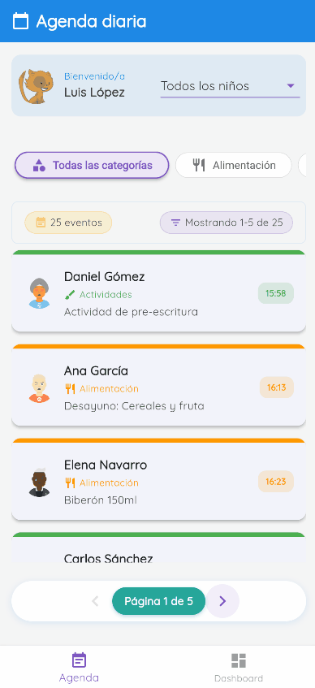
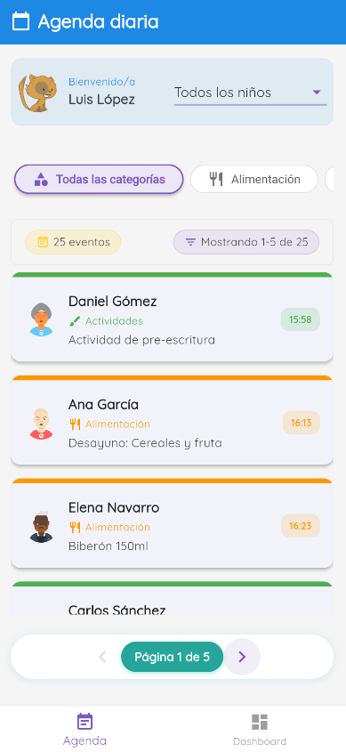
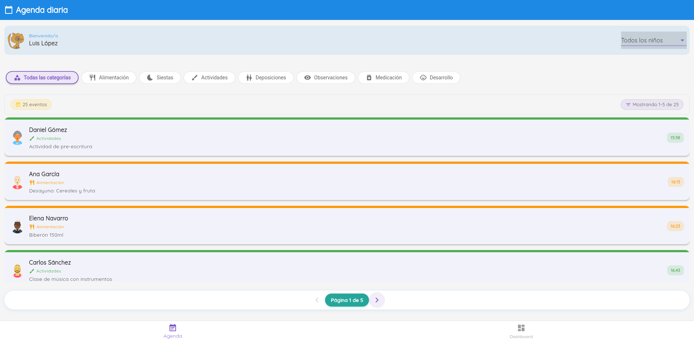
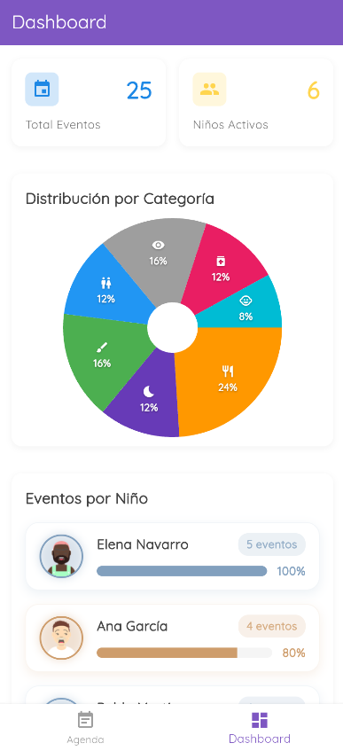
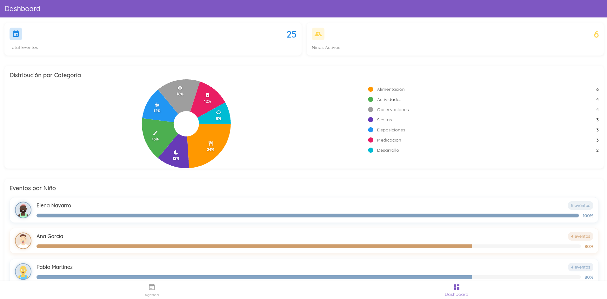

# Kids & Clouds Agenda 👶🌥️

<div align="center">


<p align="center">
  
</p>
</div>

## 📝 Descripción del Proyecto

Esta aplicación desarrollada para la prueba técnica de **Kids & Clouds** simula una agenda digital para guarderías. Permite a los padres visualizar y filtrar las actividades diarias de sus hijos a través de una interfaz intuitiva y amigable, tanto en dispositivos móviles como en navegadores web.

Se ha puesto especial énfasis en crear una experiencia de usuario fluida con una interfaz limpia y atractiva, además de implementar buenas prácticas de desarrollo y una arquitectura modular.

## 📱 Capturas de Pantalla

<div align="center">

| Versión Móvil | Versión Web |
|:-------------:|:-----------:|
|  |  |
| **Agenda** | **Agenda** |
|  |  |
| **Dashboard** | **Dashboard** |

</div>

## ✨ Características

### Agenda Diaria
- **Visualización de eventos diarios**: Muestra las actividades realizadas por cada niño durante el día
- **Filtrado por niño**: Permite seleccionar y ver solo las actividades de un niño específico
- **Filtrado por categoría**: Permite filtrar eventos por tipo de actividad (alimentación, siesta, etc.)
- **Filtrado combinado**: Aplicación simultánea de filtros por niño y categoría
- **Paginación**: Visualización de 5 eventos por página con controles de navegación
- **Contador de eventos**: Muestra cuántos eventos cumplen los criterios de filtrado actuales

### Dashboard de Estadísticas
- **Gráfico de categorías**: Visualización de proporción de eventos por categoría
- **Estadísticas por niño**: Conteo de actividades por cada niño
- **Interfaz adaptativa**: Diseño específico para móvil y web (el gráfico muestra leyenda vertical en web)

### Experiencia de Usuario
- **Interfaz responsiva**: Diseño adaptable para diferentes tamaños de pantalla
- **Navegación intuitiva**: Cambio entre agenda y dashboard desde barra inferior
- **Múltiples categorías**: 7 categorías de eventos (alimentación, siesta, actividad, deposiciones, observaciones, medicación y desarrollo)
- **Tema personalizado Kids&Clouds**: Diseño visual coherente con paleta de colores vibrante y moderna
- **Animaciones suaves**: Transiciones elegantes entre pantallas y elementos que mejoran la experiencia visual

## 🔧 Tecnologías y Decisiones Técnicas

### Stack Tecnológico

- **Flutter SDK**: Framework para desarrollo multiplataforma que permite una base de código única para móviles y web
- **Dart**: Lenguaje de programación optimizado para UI con excelente rendimiento y tipado fuerte
- **Material Design 3**: Guía de diseño para crear una interfaz moderna y coherente
- **Provider**: Gestión de estado sencilla y efectiva para esta aplicación

### Componentes y Librerías

- **Google Fonts**: Implementación de la tipografía Quicksand para mejorar la legibilidad y estética infantil
- **Robohash**: API para generar avatares únicos y amigables para los perfiles infantiles
- **Flutter Animate**: Microinteracciones y transiciones que aportan calidad profesional a la UI
- **FL Chart**: Librería para visualización de datos en el dashboard con gráficos circulares
- **Cached Network Image**: Optimización de carga de imágenes con caché local para mejorar rendimiento y experiencia de usuario

### Decisiones Técnicas

- **Arquitectura modular**: Organización del código por funcionalidades para facilitar escalabilidad y mantenimiento
- **Mocks de datos**: Capa de servicio que simula API, permitiendo una fácil migración a backend real
- **Componentes reutilizables**: Widgets especializados que mantienen consistencia visual en toda la app
- **Testing estratégico**: Priorización de pruebas en funcionalidades críticas como filtrado y renderizado

## ✨ Animaciones y Micro-interacciones

Se han implementado animaciones sutiles y elegantes para mejorar la experiencia del usuario, especialmente considerando la naturaleza infantil de la aplicación Kids&Clouds:

- **Transiciones entre pantallas**: Efectos suaves de desvanecimiento y deslizamiento al cambiar entre Agenda y Dashboard
- **Aparición de tarjetas de eventos**: Cada tarjeta aparece con animación individualizada
- **Menú de categorías animado**: Las categorías aparecen secuencialmente con un efecto visual agradable
- **Dashboard interactivo**: Las estadísticas y gráficos se presentan con animaciones que aportan dinamismo

Estas animaciones no son meramente estéticas, sino que tienen un propósito pedagógico y funcional en una aplicación destinada al entorno educativo infantil, ayudando a mantener la atención de los padres y haciendo la información más accesible y atractiva.

## Estructura del Proyecto

```
lib/
├─ main.dart                  # Punto de entrada de la aplicación
├─ controllers/               # Controladores
│   └─ pagination_controller.dart # Controlador para paginación
├─ models/                    # Definición de modelos de datos
│   ├─ child.dart             # Modelo para los niños
│   └─ event.dart             # Modelo para eventos/actividades
├─ screens/                   # Pantallas de la aplicación
│   ├─ home_screen.dart        # Pantalla principal con navegación
│   ├─ agenda_screen.dart      # Pantalla de agenda diaria
│   └─ dashboard_screen.dart   # Pantalla de dashboard con estadísticas
├─ services/                  # Servicios de datos
│   └─ mock_data_service.dart # Servicio de datos de prueba
├─ theme/                     # Configuración de tema personalizado
│   └─ app_theme.dart         # Definición del tema Kids&Clouds
├─ utils/                     # Utilidades
│   └─ string_extensions.dart # Extensiones para formateo
└─ widgets/                   # Componentes reutilizables
    ├─ agenda/                # Widgets específicos de la agenda
    │   ├─ category_menu.dart         # Menú para filtrar categorías
    │   ├─ child_selector_header.dart # Cabecera con selector de niño
    │   ├─ empty_state.dart           # Mensaje cuando no hay eventos
    │   ├─ event_card.dart            # Tarjeta de evento individual
    │   ├─ pagination_controls.dart   # Controles de paginación
    │   └─ pagination_info_bar.dart   # Barra de info de paginación
    └─ dashboard/             # Widgets del dashboard
        ├─ category_pie_chart.dart    # Gráfico circular de categorías
        ├─ child_stats_list.dart     # Lista de estadísticas por niño
        └─ stat_card.dart           # Tarjeta de estadística individual
```

## ⚙️ Instalación y Ejecución

### Prerrequisitos

- Flutter SDK (versión 3.13.0 o superior)
- Dart SDK (versión 3.1.0 o superior)
- Un editor de código (VS Code, Android Studio, IntelliJ IDEA)
- Git instalado (opcional, para clonar el repositorio)

### Requerimientos Mínimos

- Para ejecutar en móvil: Android 5.0+ o iOS 12.0+
- Para ejecutar en web: Chrome, Firefox, Safari o Edge actualizados

### Pasos de instalación

1. **Clona el repositorio** (o descarga el código fuente)
   ```bash
   git clone https://github.com/josee022/kids_and_clouds_agenda.git
   cd kids_and_clouds_agenda
   ```

2. **Instala las dependencias**
   ```bash
   flutter pub get
   ```

3. **Ejecuta la aplicación**
   - Para dispositivos móviles:
     ```bash
     flutter run
     ```
   - Para versión web (recomendado para visualizar la adaptación responsiva):
     ```bash
     flutter run -d chrome --web-renderer html
     ```

4. **Generar una build de producción** (opcional)
   - Para Android:
     ```bash
     flutter build apk --release
     ```
   - Para Web:
     ```bash
     flutter build web --release
     ```

## 🧪 Tests

La aplicación incluye una suite completa de tests automatizados, cumpliendo con el requisito obligatorio de la prueba técnica. Para ejecutarlos:

```bash
flutter test
```

### Estructura de Pruebas

Se han implementado 12 tests en total, distribuidos en tres archivos diferentes para cubrir distintos aspectos de la aplicación:

#### 1. `category_filter_test.dart` - Pruebas de UI y Componentes
- **Nombres localizados de categorías**: Verifica la correcta traducción al español de cada categoría
- **Visualización de chips de categoría**: Asegura que todos los textos de filtros aparecen correctamente
- **Interacción con filtros**: Valida que al hacer tap en un FilterChip se activa el callback con la categoría correcta
- **Resaltado visual**: Comprueba que los chips seleccionados y no seleccionados tienen el estado visual apropiado

#### 2. `mock_data_service_test.dart` - Pruebas de Lógica de Negocio
- **Filtrado sin filtros**: Verifica que se retornan todos los eventos cuando no hay criterios de filtrado
- **Filtrado por niño**: Comprueba la correcta aplicación del filtro por ID de niño
- **Filtrado por categoría**: Valida que los eventos se filtran adecuadamente por tipo de actividad
- **Filtrado combinado**: Asegura el funcionamiento correcto al aplicar filtros simultáneos (niño + categoría)
- **Casos sin coincidencias**: Verifica el manejo apropiado cuando los filtros no devuelven resultados

#### 3. `widget_test.dart` - Pruebas de Modelos y Widgets Básicos
- **PaginationInfoBar**: Valida que la barra de paginación muestra correctamente los contadores
- **Event model**: Verifica la integridad del modelo de datos para eventos
- **EventCategory**: Comprueba que la enumeración contiene todas las categorías requeridas

### Enfoque de Testing

Se ha prestado especial atención a evitar problemas comunes en pruebas de Flutter:
- Uso de finders robustos que localizan widgets incluso dentro de estructuras anidadas
- Manejo adecuado de animaciones con `pumpAndSettle()`
- Verificación tanto del comportamiento visual como funcional

Esta suite de tests garantiza que los componentes principales de la aplicación funcionan correctamente y facilita el mantenimiento a largo plazo.

## 📸 Capturas de Pantalla

A continuación se presentan algunas capturas de pantalla de la aplicación en diferentes formatos y estados:

<div align="center">

| Vista Móvil - Agenda | Vista Web - Dashboard |
|:---:|:---:|
|  |  |

</div>

*Nota: Las imágenes son representativas del diseño. La aplicación real puede variar ligeramente según la versión de Flutter y el dispositivo.*

## 📃 Enfoque y Soluciones

Desarrollé esta aplicación siguiendo estos principios clave:

### Arquitectura y Organización
- **Estructura modular** para facilitar la escalabilidad y mantenimiento
- **Separación de responsabilidades** entre modelo, vista y lógica de negocio
- **Código limpio** con nombres descriptivos y documentación adecuada

### Experiencia de Usuario
- **Interfaz intuitiva** con filtros visuales claros y feedback inmediato
- **Diseño adaptativo** que funciona tanto en móviles como en navegadores
- **Micro-animaciones sutiles** para mejorar la experiencia sin distraer
- **Paleta de colores consistente** por categorías en toda la aplicación

### Testing y Calidad
- **Suite completa de pruebas** para garantizar la funcionalidad central
- **Atención a casos extremos** en los filtros y manejo de datos
- **Finders robustos** para pruebas más fiables y menos frágiles

## 🌟 Conclusión

Esta aplicación cumple con todos los requisitos especificados en la prueba técnica para Kids&Clouds, demostrando capacidades de desarrollo en Flutter con atención al detalle, responsividad y buenas prácticas.

Aspectos destacados:
- Interfaz de usuario elegante y funcional orientada a padres
- Filtrado combinado (por niño y categoría) para localizar rápidamente la información
- Dashboard con estadísticas visuales para una rápida comprensión
- Diseño completamente responsive para móvil y web
- Código organizado y mantenible con amplia cobertura de tests

El proyecto demuestra no solo conocimientos técnicos de Flutter, sino también comprensión de las necesidades de los usuarios finales y del contexto educativo de la aplicación.

## 🤖 Uso de IA en el Proyecto

Siguiendo las indicaciones de la prueba técnica, se utilizó asistencia de IA durante el desarrollo de este proyecto. Las herramientas de IA se emplearon principalmente para:

- Generación de datos mock para la aplicación
- Optimización de la estructura del código
- Resolución de problemas específicos en las pruebas unitarias
- Mejora de la documentación técnica

El uso de IA permitió agilizar aspectos rutinarios del desarrollo, centrando el esfuerzo humano en decisiones de diseño, arquitectura y experiencia de usuario.

## 👨‍💻 Autor

José Mondelo Álvarez  
Desarrollador Flutter Junior + QA  
Candidato para Kids&Clouds  

📧 jmondelo@example.com  
🔗 [LinkedIn](https://linkedin.com/in/josemondelo)  
🔗 [GitHub](https://github.com/josee022)
